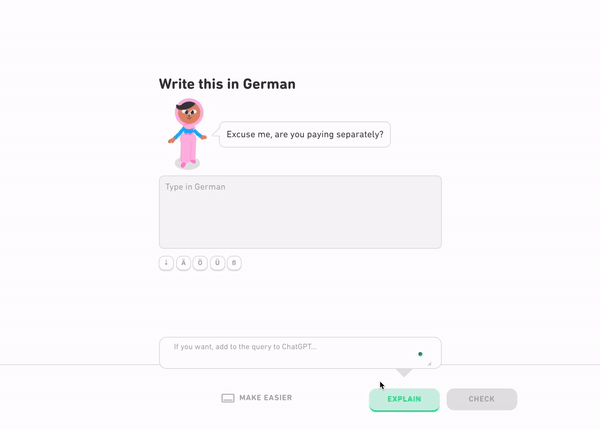
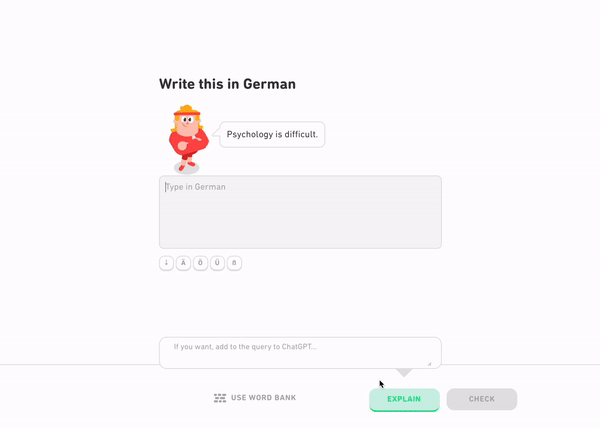
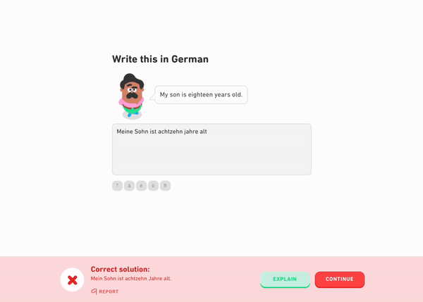
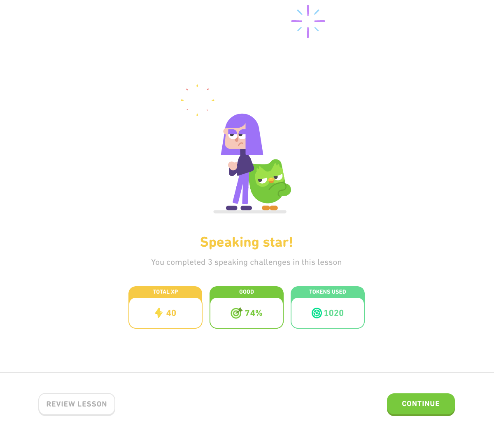
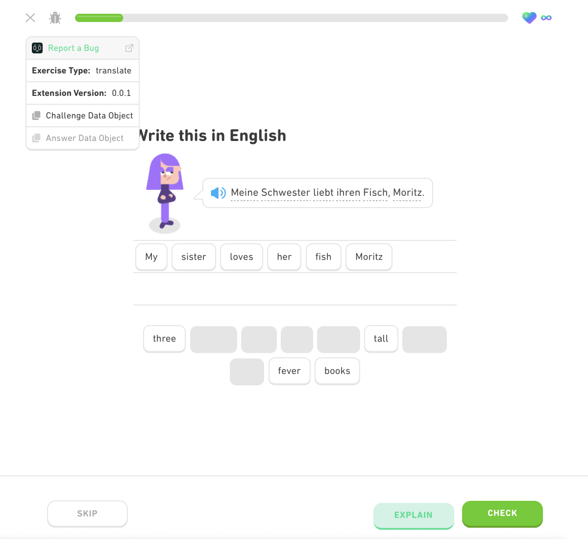

# Duo Explained

  

  <strong>Browser extension that integrates OpenAI's interface to ChatGPT with Duolingo's exercises.</strong>

  
  
  
  
 
  
  
   
   
   
   

---

  
  
   

---

## Table of Contents
- [Introduction](#introduction)
- [Features](#features)
    - [Explain an Exercise Before Answering](#explain-an-exercise-before-answering)
    - [Explain Why Your Answer Was Wrong/Right](#explain-why-your-answer-was-wrongright)
    - [Add a Custom Question When Asking for an Explanation](#add-a-custom-question-when-asking-for-an-explanation)
    - [See How Many Tokens Were Spent](#see-how-many-tokens-were-spent)
    - [Report a Bug](#report-a-bug)
- [Mobile Setup](#mobile-setup)
- [Documentation](#documentation)
- [Contributors](#contributors)
- [License](#license)

---

## Introduction

Duo Explained is a browser extension designed to integrate OpenAI's ChatGPT capabilities directly with Duolingo exercises, helping users understand language learning better through AI-assisted explanations.

---

## Features

#### Explain an Exercise Before Answering
* Easily request an explanation of a Duolingo exercise before submitting your answer.
  
  

#### Explain Why Your Answer Was Wrong/Right
* Understand why your answer was correct or incorrect with detailed explanations from ChatGPT.
  
  

#### Add a Custom Question When Asking for an Explanation
* Customize your query when requesting explanations to get more specific feedback.
  
  

#### See How Many Tokens Were Spent
* Keep track of the tokens used during at the end of a lesson to manage your usage effectively.
  
  

#### Report a Bug
* Report a bug directly from the extension to help us improve the user experience.

  

---

## Mobile Setup

To use the extension on mobile, you need to use a browser that supports extensions. Please follow the detailed steps in [SETUP.md](SETUP.md).

---

## Documentation

Comprehensive documentation for developers and contributors can be found in [docs/README.md](docs/README.md).

---

## Contributors

- [André Clerigo](https://github.com/andreclerigo)
- [Diogo Correia](https://github.com/digas99)

---

## License

Duo Explained is licensed under the [MIT License](LICENSE).

---

