# Duo Explained Mobile

Duo Explained is a Browser Extension. It is not directly available for mobile devices (much less the Duolingo Mobile App).

However, you can still use it on your mobile device by using a browser that supports extensions. In this guide, we will be covering some browsers we have tested, but you should be able to use any browser that supports extensions.

Because the Duolingo Web App is a Progressive Web App (PWA), it will feel like you are using the Duolingo Mobile App.

Here is a step-by-step guide on how to use Duo Explained on your mobile device:

## Browsers
- [Edge Canary](#edge-canary)
- [Kiwi Browser](#kiwi-browser) *(deprecated)*

## Edge Canary

### Extension Installation

1. Install Edge Canary from the [Google Play Store](https://play.google.com/store/apps/details?id=com.microsoft.emmx.canary).

	
	
2. Open Edge Canary and browse all the way to `Privacy and Terms`.

	

		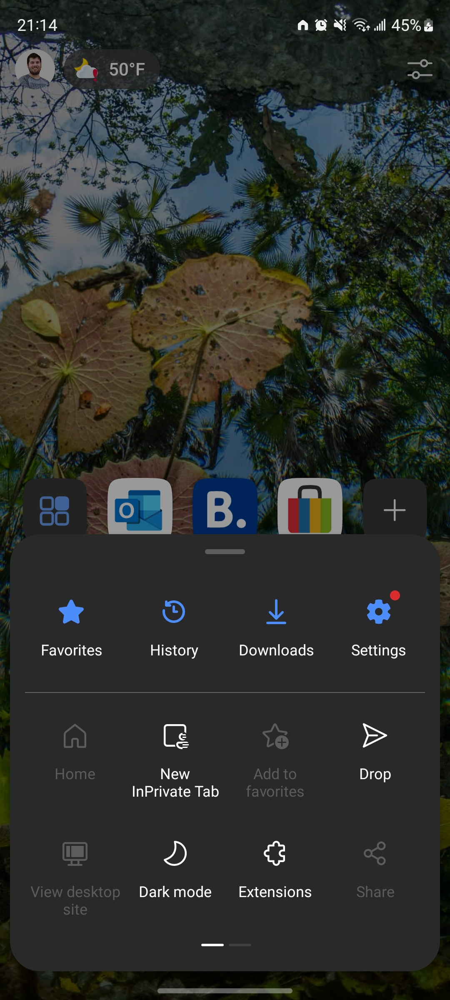
		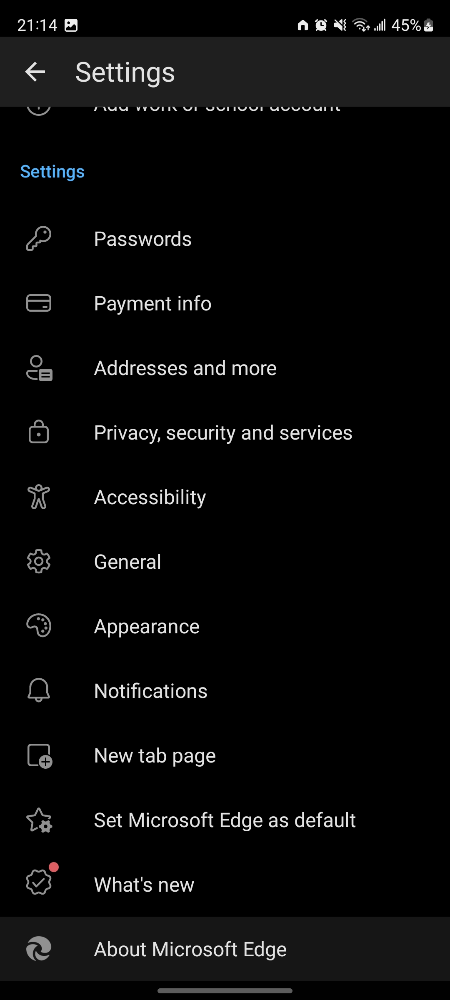
		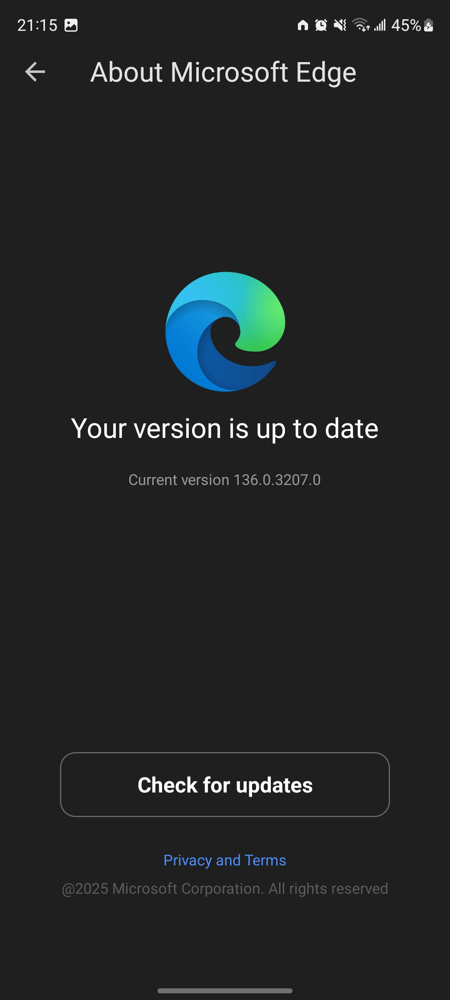
	

3. Enable **Developer Mode** by entering `Privacy and Terms` and tapping 5 times in the build number `Edge Canary 136.x.x.x`.

	

		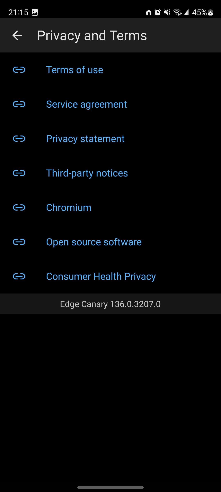
		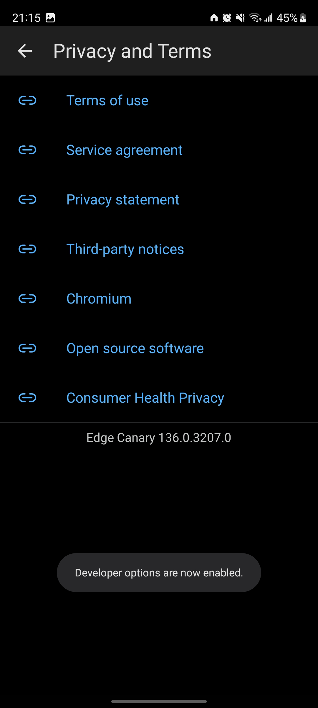
	

4. Browse all the way back to the settings menu. You will now find a new option called `Developer Options`.

	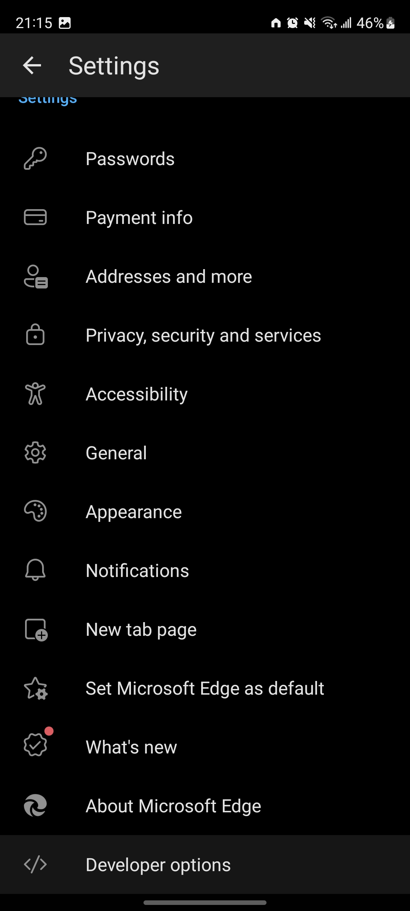

5. Open `Developer Options`, choose `Extension install by id` and enter the Duo Explained extension ID: `nnpjjoallbghaipnhlphaljdamnhjogn`. This id is found in the [Edge Add-ons Store URL of the extension](https://microsoftedge.microsoft.com/addons/detail/duo-explained/nnpjjoallbghaipnhlphaljdamnhjogn).

	

		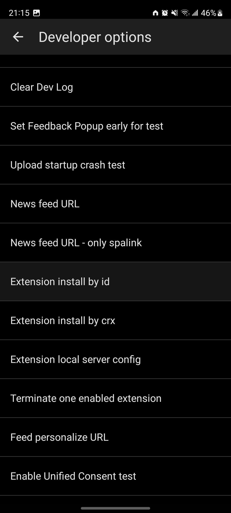
		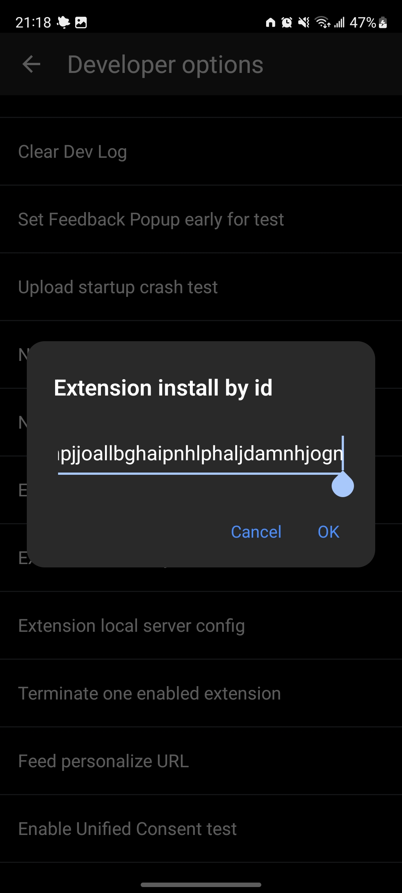
		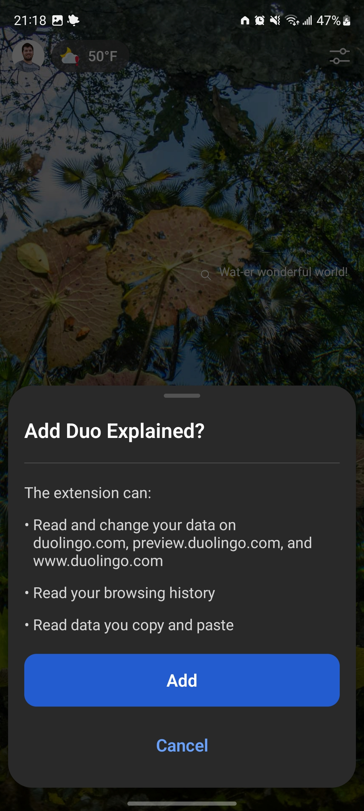
	

6. After installing the extension (this may take a minute), open again the menu shown in the beginning of this guide, click on `Extensions` and confirm that the extension is installed. Here you may also setup your OpenAI API key (as you would on a desktop browser - [see here](API_KEY.md)).

	

		
		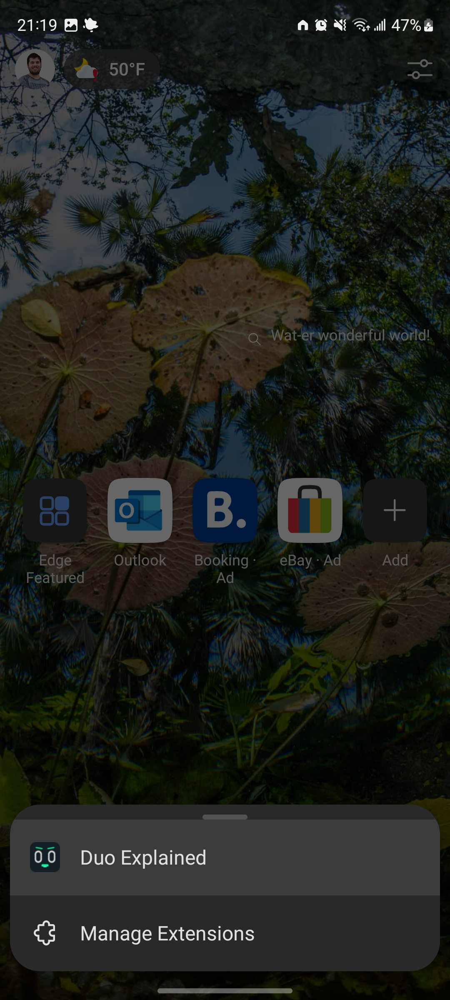
		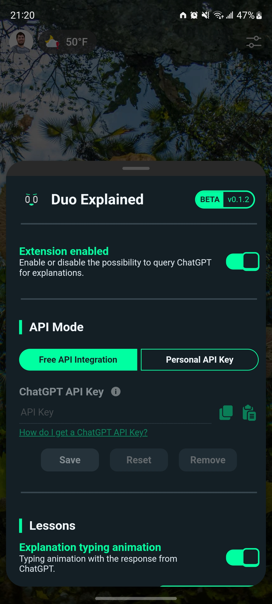
	

### Duolingo App

1. Open the Duolingo Web App on Edge Canary.

2. On the browser menu (same menu from the beginning of this guide), swipe left and click on `Add to phone`.

	

		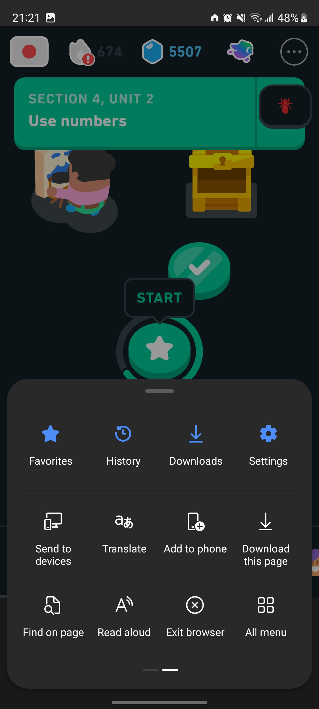
		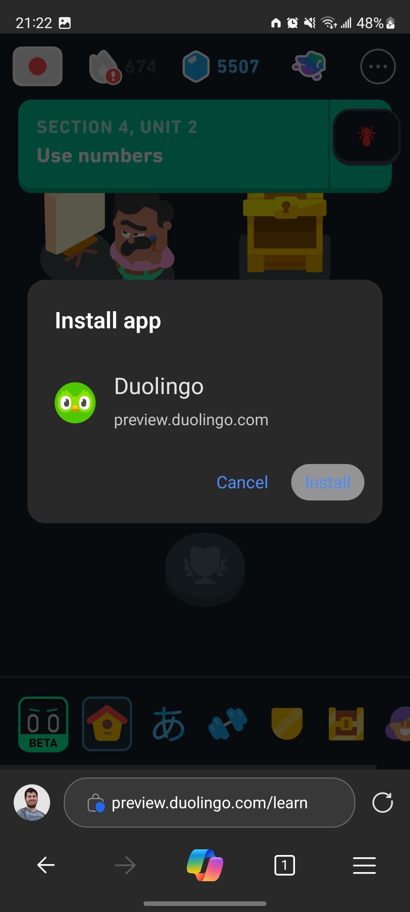
	

3. It sould now be available on your home screen, and if you open it from there, it will feel like you are using the Duolingo Mobile App (it will never be the same as the actual Duolingo Mobile App because it is limited to what features the Duolingo team implements in the browser version, but it is still a very good and complete experience).

	

		
		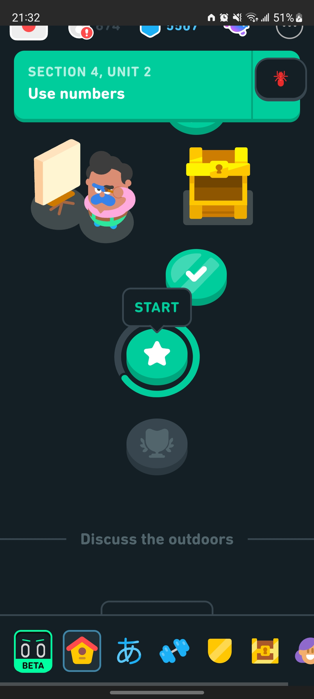
	

4. Start a lesson and try it for yourself!
   
   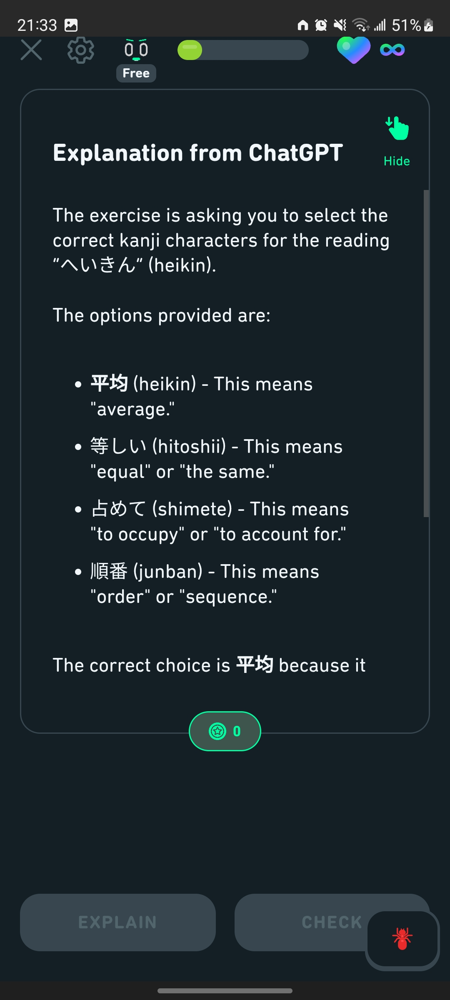

## Kiwi Browser

> **Note:** Kiwi Browser is no longer being updated. The developers recommend using Edge Canary instead. If you still want to use Kiwi Browser, you can get the APK from their official source [Release 12867802748](https://github.com/kiwibrowser/src.next/releases/tag/12867802748).

### Extension Installation

1. ~~Install Kiwi Browser from the~~[~~Google Play Store~~](https://play.google.com/store/apps/details?id=com.kiwibrowser.browser). *(Please check the note above)*

	

2. Open Kiwi Browser, go to the Chrome Web Store and install [Duo Explained](https://chromewebstore.google.com/detail/duo-explained/ibnifmdhbaknbkgldmbnebeidephchno).

	

		
		
	

3. Open the Duo Explained extension from the Browser Menu and setup your OpenAI API key (as you would on a desktop browser - [see here](API_KEY.md)).

	

		
		
	

### Duolingo App

1. Open the Duolingo Web App on Kiwi Browser.

2. On the Browser Menu, click on `Add to Home screen`.

	

		
		
	

3. It sould now be available on your home screen, and if you open it from there, it will feel like you are using the Duolingo Mobile App (it will never be the same as the actual Duolingo Mobile App because it is limited to what features the Duolingo team implements in the browser version, but it is still a very good and complete experience).

	

		
		
	

4. Start a lesson and try it for yourself!
   
   
